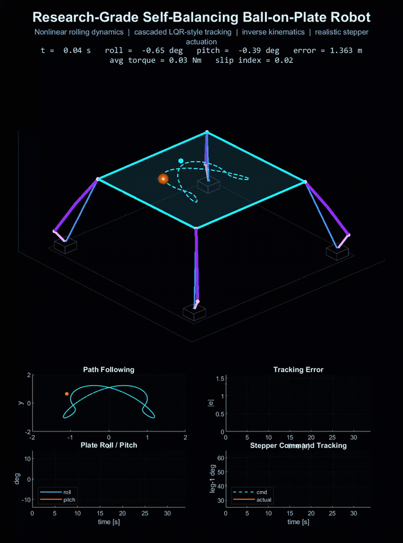
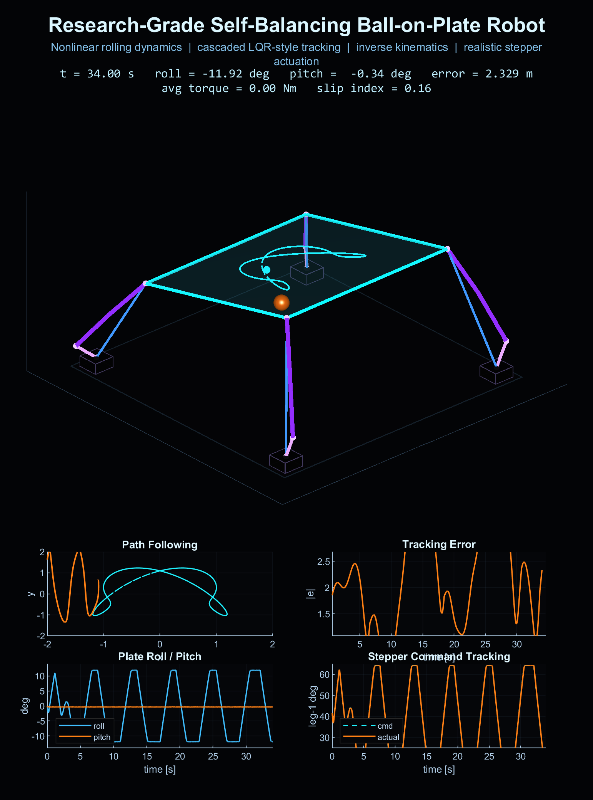
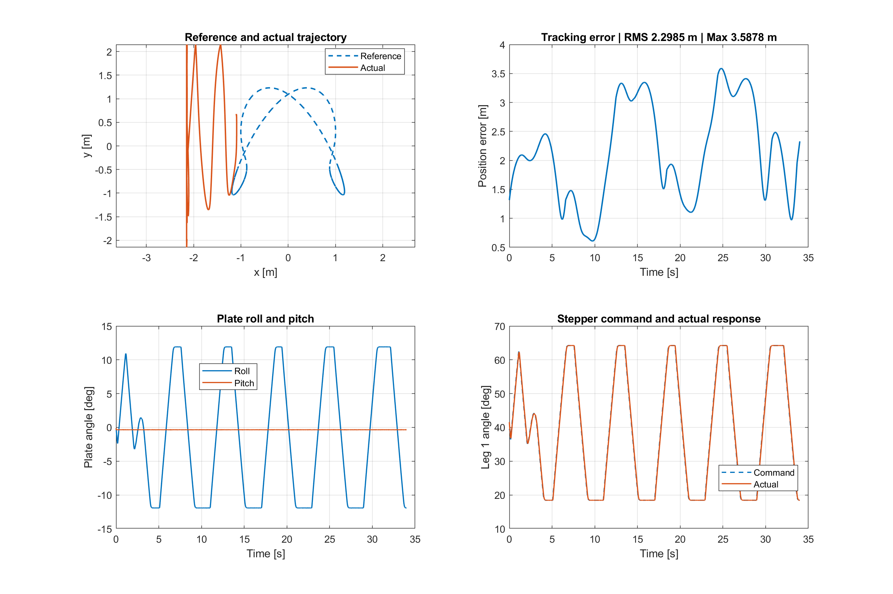

<p align="center">
  
  
  
  
</p>

<p align="center">
  
</p>

<h1 align="center">Ball-on-Plate MATLAB Simulation</h1>

<p align="center">Nonlinear ball dynamics, trajectory tracking, and four-stepper actuation with live 3D visualization.</p>

## Overview

A MATLAB simulation of a ball moving on a tilting plate. A PID-style tracking controller with acceleration feedforward generates tilt commands, while four simulated stepper actuators drive the platform.

- Nonlinear rolling dynamics, friction, disturbances, and sensor noise.
- Smooth reference trajectory and live tracking diagnostics.
- Actuator lag, speed limits, microstepping, and backlash.
- Automatic video and PNG exports to the `result` folder.

## Run

Open `Ball_On_Plate_Research_Grade_Simulation.m` in MATLAB and click **Run**, or enter:

```matlab
Ball_On_Plate_Research_Grade_Simulation
```

No Control System Toolbox is required. Adjust duration, time step, and video export in **User Options**.

## Simulation Results

**Final simulation view**

<p align="center">
  
</p>

**Tracking and actuator response**

<p align="center">
  
</p>

The plots show reference versus actual motion, position error, roll/pitch, and leg-1 command tracking. The Command Window reports RMS error, maximum error, mean torque, and maximum tilt.

Video exports as MP4, or AVI when MPEG-4 is unavailable. This is a simulation model; hardware performance has not been validated.
